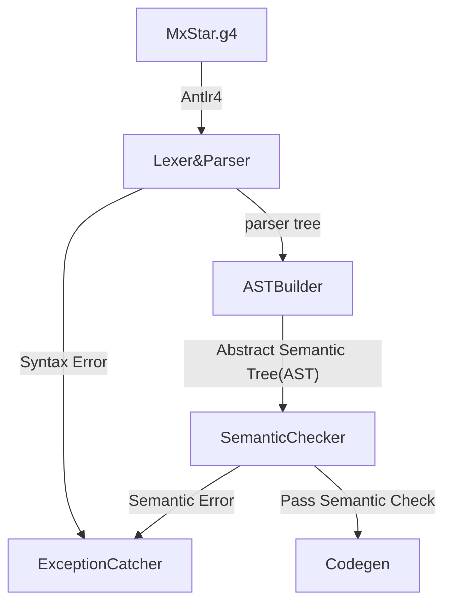

# Mx-Compiler-for-Course

This is a Compiler of Mx*(a toy language designed for tutoring) for *ACM class, Shanghai Jiao Tong University*.

[Assignment Homepage](https://github.com/ACMClassCourses/Compiler-Design-Implementation)

## Frontend(Semantic Check)

### Working Process

### Design of g4

#### Regular Expression

- `|`       color|colour matches both color and colour
- `*`       $A^* = \{empty, A, AA, AAA, ...\}$
- `+`       $A^+ = \{A, AA, AAA, ...\}$  

#### Lexer

only list the tricky part.

Identifier: `[a-zA-Z][a-zA-Z_0-9]*`

ESC : `'\\"' | '\\\\'`  (to handle escape character)

StringConst :  `'"' (ESC | .)*? '"'` (`.` means anything)

LineComment : `'//' .*? '\r'? '\n' -> skip` (comment should be aborted)

BlockComment : `'/*' .*? '*/' -> skip`

EndFileComment : `'//' ~[\r\n]* -> skip`	(`~[\r\n]` means anything but `\r` and `\n`) (A nasty case. It happens when programmer write a line comment at of and of file. Then there is no `\r` or `\n` to mark that the line comment has come to an end.)

WhiteSpace: `[ \t] -> skip`

NewLine: `('\r\n' | '\n') -> skip`

### Parser

### Semantic Check

#### Details that are easily ignored

- `++a` can be recognized as a left value but `a++` can't
- `null` can be assigned to array or class
- Variable is not available for back reference in global scope, but function and class can.
- Variable is available for back reference in class scope. (So I add all variable registries into class scope when AST building)
- `int x = x + 1`  is a semantic error. You should add registry of x at the end of variable define, not beginning.

- Variable, function and class can't share a same name at one scope.
- `int [] [] graph = new int [][4]` is a semantic error. The assignment of 2-D array should follow the order from the first dimension.
